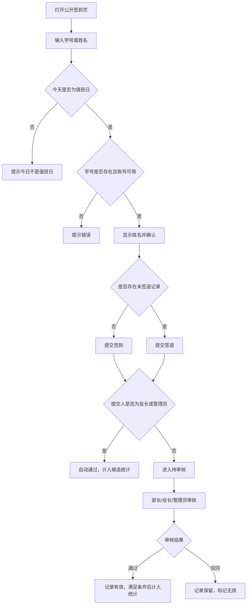

# 计算机协会值班签到签退系统需求说明书

## 1. 项目概述

本系统用于计算机协会日常值班及协会事务管理。系统采用本地网页形式部署在单台 Windows 电脑上，只通过本机地址访问；成员在公开签到页输入学号或姓名提交签到或签退，管理人员登录后台完成审核、成员、培训、排班、维修、统计、导出和备份工作。

第一版重点解决：

- 值班成员快速签到、签退
- 部长、会长、管理员审核值班记录
- 成员维护自己的基础联系方式
- 会长、管理员维护成员信息、批量导入成员、按筛选结果批量启用或停用账号
- 会长、管理员查看统计并导出 Excel
- 会长、管理员管理培训、部长排班和维修事务
- 会长、管理员执行完整数据备份
- 管理员修改记录时可追溯

## 2. 用户角色

系统包含四类角色：

| 角色 | 定位 |
| --- | --- |
| 成员 | 普通协会成员，参与值班 |
| 部长 | 协助查看和审核签到签退记录 |
| 会长 | 协会业务最高权限，负责成员、角色、统计和导出 |
| 管理员 | 系统维护者/开发者使用，拥有最高系统维护权限 |

系统不设置部门体系。

## 3. 权限设计

| 功能 | 成员 | 部长 | 会长 | 管理员 |
| --- | --- | --- | --- | --- |
| 公开页签到/签退 | 可以 | 可以 | 可以 | 可以 |
| 登录后台 | 可以 | 可以 | 可以 | 可以 |
| 修改本人手机号、学院、年级、QQ | 可以 | 可以 | 可以 | 可以 |
| 查看本人值班记录 | 可以 | 可以 | 可以 | 可以 |
| 查看全部签到记录 | 不可以 | 可以 | 可以 | 可以 |
| 审核成员记录 | 不可以 | 可以 | 可以 | 可以 |
| 审核部长记录 | 不可以 | 可以，但不能审核自己 | 可以 | 可以 |
| 审核会长记录 | 不需要审核 | 不需要审核 | 自动有效 | 自动有效 |
| 审核管理员记录 | 不需要审核 | 不需要审核 | 自动有效 | 自动有效 |
| 查看成员管理页面 | 不可以 | 不可以 | 可以 | 可以 |
| 创建成员账号 | 不可以 | 不可以 | 可以 | 可以 |
| 批量导入成员 | 不可以 | 不可以 | 可以 | 可以 |
| 按职位、年级、关键词筛选成员 | 不可以 | 不可以 | 可以 | 可以 |
| 启用/停用单个成员账号 | 不可以 | 不可以 | 可以 | 可以 |
| 按筛选结果批量启用/停用成员账号 | 不可以 | 不可以 | 可以 | 可以 |
| 删除成员账号 | 不可以 | 不可以 | 不可以 | 可以 |
| 任命部长 | 不可以 | 不可以 | 可以 | 可以 |
| 任命会长 | 不可以 | 不可以 | 可以 | 可以 |
| 任命管理员 | 不可以 | 不可以 | 不可以 | 可以 |
| 调整值班星期 | 不可以 | 不可以 | 可以 | 可以 |
| 调整值班时间段和排班 | 不可以 | 不可以 | 可以 | 可以 |
| 管理培训 | 不可以 | 不可以 | 可以 | 可以 |
| 管理维修事务 | 不可以 | 可以 | 可以 | 可以 |
| 导出维修事务 | 不可以 | 不可以 | 可以 | 可以 |
| 删除维修事务到回收站 | 不可以 | 不可以 | 可以 | 可以 |
| 查看、恢复维修回收站 | 不可以 | 不可以 | 不可以 | 可以 |
| 永久删除维修事务 | 不可以 | 不可以 | 不可以 | 可以，且先自动备份 |
| 新增签到记录 | 不可以 | 不可以 | 可以 | 可以 |
| 删除签到记录 | 不可以 | 不可以 | 可以 | 可以 |
| 修改签到记录 | 不可以 | 不可以 | 不建议开放 | 可以 |
| 导出 Excel | 不可以 | 不可以 | 可以 | 可以 |
| 查看统计排行 | 不可以 | 可以 | 可以 | 可以 |

说明：

- 会长和管理员的签到/签退记录无需审核，提交后自动有效。
- 成员和部长的签到/签退记录需要审核。
- 部长不能审核自己的记录。
- 部长不进入成员管理页面，也不能新增、导入、启用或停用成员账号。
- 会长不能修改管理员账号；管理员相关账号只能由管理员维护。
- 批量停用账号时，当前登录账号不会被批量停用。
- 管理员修改任何签到记录时，必须填写修改原因并保留操作日志。
- 会长或管理员删除签到记录前，系统必须自动创建安全备份并保留操作日志。
- 培训页面只对会长和管理员开放，部长不能进入培训页面。
- 部长可以管理维修事务，但不能导出维修事务。
- 会长和管理员可以将维修事务移入回收站；只有管理员可以查看、恢复或永久删除回收站内容。

## 4. 账号与成员信息

### 4.1 登录方式

成员、部长、会长、管理员均使用：

- 学号
- 密码

登录系统后台。

### 4.2 学号规则

- 学号是用户唯一身份标识。
- 系统不允许重复学号。
- 公开签到页只需要输入学号或姓名，不需要登录。

### 4.3 初始密码

- 新成员初始密码默认为学号后六位。
- 首次登录后建议强制修改密码。
- 初始管理员账号由部署人员创建，首次登录后也应强制修改密码。

### 4.4 成员资料

成员登录后可以自行维护：

- 手机号
- 学院
- 年级
- QQ

基础身份信息建议由会长或管理员维护：

- 姓名
- 学号
- 角色
- 账号状态

### 4.5 账号停用

- 会长和管理员可以启用或停用账号。
- 会长和管理员可以对当前筛选后的成员列表批量启用或批量停用账号。
- 会长不能启用或停用管理员账号。
- 批量停用时，系统应跳过当前登录账号，避免操作者把自己停用。
- 停用后不能登录。
- 停用后不能签到或签退。
- 历史记录保留。
- 管理员可以删除没有值班记录的成员账号；已有值班记录的成员账号不允许删除，应改为停用。

### 4.6 批量导入成员

会长和管理员可以通过 Excel 批量导入成员。

导入规则：

- 系统提供 Excel 模板下载。
- 导入字段包括：学号、姓名、手机号、学院、年级、QQ。
- 学号和姓名必填。
- 新学号创建为普通成员，初始密码为学号后六位。
- 已存在学号只更新姓名、手机号、学院、年级、QQ，不修改角色、账号状态和密码。
- 导入时空 QQ 不覆盖已有 QQ。
- 文件内重复学号、缺少姓名或学号、年级格式不合法的行应跳过并返回原因。

## 5. 签到签退业务规则

### 5.1 使用场景

系统只有一个业务场景：计算机协会值班。

不做多活动管理，不做成员个人排班管理。任何未停用成员都可以提交签到和签退；值班星期和值班时间段用于排班展示及有效时长判定，不阻止本机测试提交。

### 5.1.1 值班星期配置

会长和管理员可以在后台调整值班星期。

配置规则：

- 以星期为单位配置，例如星期一、星期三、星期五。
- 当前日期属于已启用的值班星期时，记录可以按审核结果计入有效时长。
- 当前日期不属于已启用的值班星期时仍允许测试提交，但记录默认不计入有效值班时长。
- 会长或管理员可通过后台新增签到记录；管理员可手动补改特殊情况，相关操作必须填写原因并保留日志。
- 值班星期配置变更需要记录操作日志。
- 历史记录按提交当天的值班星期配置判断是否有效，后续调整值班星期不反向改变历史记录。

### 5.2 公开签到页

公开签到页通过以下形式访问：

```text
http://127.0.0.1:8080
```

页面功能：

1. 输入学号或姓名
2. 系统查询成员信息
3. 显示姓名确认
4. 如出现同名成员，用户先选择自己对应的学号
5. 用户确认后提交签到或签退
6. 提交成功后保留结果，用户点击“下一位”回到输入状态

页面下方按后台设置的值班时间段横向显示今日部长排班和当前时段进度，并显示本周排班概览。

如果学号或姓名不存在、账号已停用、同名需要选择或信息异常，应给出明确提示。

### 5.3 自动判断签到或签退

系统根据当前用户最近一条记录自动判断操作类型：

- 如果该学号不存在“已签到但未签退”的记录，则本次操作为签到。
- 如果该学号存在“已签到但未签退”的记录，则本次操作为签退。

### 5.4 多次值班

- 同一成员同一天允许多次签到和签退。
- 每一次完整的签到到签退形成一条值班记录。
- 不考虑跨天值班。

### 5.5 待审核时允许签退

即使签到仍处于待审核状态，成员也允许继续提交签退。

示例：

```text
08:00 张三提交签到，状态为待审核
12:00 张三提交签退，状态为待审核
部长/会长/管理员后续统一审核签到和签退
```

### 5.6 忘记签退

如果成员当天签到后忘记签退：

- 记录保留为未签退状态。
- 不计入有效值班时长。
- 会长或管理员可以新增签到记录；管理员可以手动补改，但必须填写修改原因，并保留日志。

### 5.7 核心流程图



## 6. 审核规则

### 6.1 审核对象

| 提交人角色 | 签到是否审核 | 签退是否审核 |
| --- | --- | --- |
| 成员 | 需要 | 需要 |
| 部长 | 需要 | 需要 |
| 会长 | 不需要，自动有效 | 不需要，自动有效 |
| 管理员 | 不需要，自动有效 | 不需要，自动有效 |

### 6.2 审核人

| 被审核人 | 可审核人 |
| --- | --- |
| 成员 | 部长、会长、管理员 |
| 部长 | 其他部长、会长、管理员 |
| 会长 | 无需审核 |
| 管理员 | 无需审核 |

### 6.3 审核结果

审核结果包括：

- 通过
- 驳回

驳回记录不删除，保留为无效记录，便于追溯。

### 6.4 审核信息

每次审核需要记录：

- 审核状态
- 审核人
- 审核时间

驳回时建议填写驳回原因。

## 7. 值班记录

每条值班记录至少包含：

| 字段 | 说明 |
| --- | --- |
| 记录 ID | 系统自动生成 |
| 学号 | 成员唯一标识 |
| 姓名 | 冗余保存，方便导出和查看 |
| 值班日期 | 签到发生的日期 |
| 值班星期 | 签到发生时对应的星期 |
| 是否值班日 | 按提交当天配置判断是否为值班日 |
| 签到时间 | 用户提交签到的时间 |
| 签退时间 | 用户提交签退的时间，可为空 |
| 签到审核状态 | 待审核、通过、驳回、自动通过 |
| 签退审核状态 | 待审核、通过、驳回、自动通过 |
| 签到审核人 | 审核签到的人 |
| 签退审核人 | 审核签退的人 |
| 签到审核时间 | 签到审核完成时间 |
| 签退审核时间 | 签退审核完成时间 |
| 有效时长 | 签退时间减签到时间后按小时取整数 |
| 有效状态 | 是否计入统计 |
| 创建时间 | 记录创建时间 |
| 更新时间 | 记录更新时间 |

有效时长计算规则：

- 只有签到和签退均通过或自动通过后，才计算有效时长。
- 有效时长 = 签退时间 - 签到时间，单位为小时。
- 结果取整数小时，按分钟四舍五入。
- 不足 30 分钟的部分舍去，达到 30 分钟及以上进 1 小时。
- 示例：1 小时 15 分钟记为 1 小时；2 小时 34 分钟记为 3 小时。
- 如果缺少签退时间、记录被驳回或不满足有效统计条件，有效时长记为 0。

## 8. 统计与导出

### 8.1 统计规则

只有满足以下条件的记录才计入有效统计：

- 签到已通过或自动通过
- 签退已通过或自动通过
- 签到时间和签退时间都存在
- 签退时间晚于签到时间
- 记录未被驳回
- 记录提交当天属于已启用的值班星期，或由管理员后台补改并说明原因

### 8.2 统计内容

第一版需要支持：

- 按日期范围查询
- 每人值班总次数
- 每人值班总时长，按有效时长求和
- 值班排行
- 明细记录列表

### 8.3 Excel 导出

会长和管理员可以在数据中心进行自定义 Excel 导出。每次只选择一个数据源，可选成员、值班记录、培训记录、部长排班和维修事务；管理员额外可选操作日志。

用户可以设置该数据源支持的筛选条件、勾选字段、调整列顺序并填写文件名。系统不保存导出模板，不提供样式编辑，并通过后端字段白名单阻止密码等敏感字段导出。

同一周内的值班日需要在第一行合并为一个大标题，例如“第一周（9月1日-9月5日）”。第二行展示具体值班日，每个成员对应单元格展示当天有效时长，最后一列展示查询日期范围内该成员的有效总时长。

## 9. 后台功能模块

### 9.1 登录模块

- 学号密码登录
- 只在本机记住账号，不保存密码
- 支持显示或隐藏密码
- 登录成功后显示身份验证通过状态再进入后台
- 根据角色进入不同后台页面
- 首次登录建议强制修改密码

### 9.2 成员个人中心

成员可操作：

- 查看自己的资料
- 修改手机号、学院、年级、QQ
- 修改密码
- 查看自己的值班记录和统计

### 9.3 审核管理

部长、会长、管理员可操作：

- 查看待审核记录
- 按日期、姓名、学号筛选
- 审核通过
- 审核驳回
- 查看已审核记录

### 9.4 成员管理

会长、管理员可操作：

- 新增成员
- 通过 Excel 批量导入成员
- 按姓名、学号、手机号、学院搜索成员
- 按职位筛选成员
- 按年级筛选成员
- 编辑成员基础信息
- 停用成员
- 启用成员
- 对当前筛选后的成员列表批量停用
- 对当前筛选后的成员列表批量启用
- 任命部长
- 任命会长
- 重置成员密码

管理员额外可操作：

- 任命管理员
- 删除没有值班记录的成员账号

角色任命规则：

- 部长可以由会长或管理员任命。
- 会长可以由会长或管理员任命。
- 管理员只能由管理员任命。
- 会长不能修改管理员账号。

### 9.5 统计导出

会长、管理员可操作：

- 按日期范围统计
- 查看个人汇总
- 查看值班排行
- 导出 Excel

部长可查看统计和明细，但不允许导出 Excel。

### 9.6 值班设置

会长、管理员可操作：

- 查看当前启用的值班星期
- 调整值班星期
- 保存值班星期配置
- 新增、删除和值班时间段保存
- 排班时只能选择已经保存的值班时间段

值班星期配置变更需要进入操作日志。

### 9.7 系统维护

会长和管理员可操作：

- 删除签到签退记录，删除前自动创建安全备份
- 执行一键备份

管理员额外可操作：

- 修改签到签退记录
- 清空操作日志
- 填写修改原因
- 进行数据维护

只有管理员可查看操作日志。

会长可新增和删除签到记录，但不能修改签到时间，不能查看或清空操作日志。

会长和管理员可在后台执行一键备份，备份内容包括成员、签到、培训、排班、维修、操作日志、值班星期、值班时间段和系统配置。管理员可删除或恢复备份文件。

待审核记录支持批量通过签到、批量通过签退或批量全部通过；批量驳回不做，避免原因不清导致误操作。

后台概览需要展示今日签到记录数、今日未签退人数、今日待审核数、今日有效时长、本周有效时长、本年有效时长和当前值班星期。

### 9.8 培训管理

培训页面只对会长和管理员开放，支持培训场次、主讲人、地点、时间、说明和参与名单管理。参与记录必须包含计入值班统计的培训时长；Excel 导入模板第一条数据默认作为主讲人记录。培训不使用“状态”和“来源”字段。

### 9.9 部长排班

会长和管理员按星期及已保存的值班时间段安排部长。签到台和后台首页按同一设置自动分组显示，不允许排班使用未设置的时间段。排班支持 Excel 模板下载、全量校验预览和确认导入；模板每行一人，学号必填，只允许启用状态的部长、会长或管理员。同一星期和时段的多行合并为一组，导入只覆盖文件中实际出现的分组，任意一行错误时整份文件均不写入。

### 9.10 维修事务

部长、会长和管理员可以管理维修事务；状态只使用“进行中”“已完成”“已取消”。协议分为维修协议和免责协议。维修记录不包含单位/学院和序列号字段。维修事务导出只对会长和管理员开放。会长和管理员可以软删除事务；只有管理员可以查看回收站、恢复事务，或在输入完整维修编号并自动生成安全备份后永久删除。

## 10. 操作日志

以下操作必须记录日志：

- 管理员修改签到记录
- 会长或管理员新增签到记录
- 会长或管理员删除签到记录
- 部长、会长或管理员审核签到签退记录
- 会长或管理员调整值班星期
- 成员账号停用或启用
- 按筛选结果批量启用或停用成员账号
- 批量导入成员
- 管理员删除成员账号
- 角色变更
- 密码重置

日志至少包含：

| 字段 | 说明 |
| --- | --- |
| 操作人 | 谁执行了操作 |
| 操作类型 | 修改记录、停用账号、角色变更等 |
| 操作对象 | 被修改的用户或记录 |
| 修改前内容 | 修改前关键数据 |
| 修改后内容 | 修改后关键数据 |
| 操作原因 | 管理员填写 |
| 操作时间 | 系统记录 |

管理员可按当前筛选条件导出操作日志 Excel。管理员可清空全部操作日志，清空前系统应进行强确认，并建议先导出留档。

## 11. 技术方案

当前技术栈：

| 层级 | 技术 |
| --- | --- |
| 前端 | Vue 3 |
| 后端 | Spring Boot |
| 数据库 | SQLite 单文件数据库 |
| 部署系统 | Windows 本地电脑 |
| 运行方式 | Electron 桌面端管理 Spring Boot 本机服务 |
| 访问方式 | 本机 `127.0.0.1:8080` |

第一版不考虑云服务器部署，不配置 Nginx，不配置域名，不配置 HTTPS。

建议将 Vue 前端打包后放入 Spring Boot 静态资源目录，让前端和后端共用同一个服务端口。

访问地址形式：

```text
http://127.0.0.1:8080
```

系统仅供部署电脑本机使用，不开放局域网访问，也不需要配置防火墙入站规则。

## 12. 本地环境要求

正式发行包支持 Windows 10/11 x64，内置 JRE 21 和 SQLite JDBC，不需要安装 Java、数据库服务或联网。只有源码构建需要：

- JDK 21
- Maven 3.9+
- Node.js 22.12+

其中：

- SQLite 用于保存成员、签到、培训、排班、维修和操作日志。
- Maven 用于构建 Spring Boot 后端。
- Node.js 用于构建 Vue 前端。
- 正式日常使用通过 Electron 启动本机后端。点击桌面窗口关闭按钮后应用驻留 Windows 托盘；从托盘菜单选择“完全退出”时同步停止服务。

发行方式包括 Windows 安装程序和便携 ZIP；源码目录保留 `start.bat` 供开发运行。后台“数据”页面允许会长和管理员一键备份业务数据。

系统只在本机访问，不需要开放 Windows 防火墙端口。

## 13. 数据备份

系统需要支持不依赖外部数据库工具的本地完整备份。

建议规则：

- 提供后台一键备份功能，不依赖外部备份脚本。
- 备份文件按日期时间命名。
- 备份内容包括全部业务表和日志表。
- 备份文件存放在应用根目录的 `backups/app` 文件夹。
- 恢复备份前自动保存当前数据，并在恢复后注销现有令牌。
- 整机迁移时先退出应用，再复制包含 `app`、`data` 和 `backups` 的完整根目录。

## 14. 第一版不做的功能

第一版暂不做：

- 部门管理
- 多活动管理
- 个人排班管理
- 迟到早退判断
- 跨天值班
- 定位签到
- 人脸识别
- 手机短信验证
- 微信小程序
- 域名和 HTTPS
- 云服务器部署
- 公网访问
- 公告通知

## 15. 验收标准

第一版完成后，应满足以下条件：

1. 可以在本地通过 `http://127.0.0.1:8080` 打开系统。
2. 公开签到页可以输入学号或姓名并显示姓名确认；出现重名时可以选择对应学号。
3. 成员可以成功提交签到和签退。
4. 成员和部长提交的签到、签退进入待审核状态。
5. 会长和管理员提交的签到、签退自动有效。
6. 部长、会长、管理员可以登录后台审核记录。
7. 部长不能审核自己的记录。
8. 会长和管理员可以新增、编辑、启用、停用成员。
9. 会长和管理员可以按职位、年级和关键词筛选成员。
10. 会长和管理员可以通过 Excel 批量导入成员。
11. 会长和管理员可以对筛选后的成员列表批量启用或批量停用。
12. 管理员可以删除没有值班记录的成员账号。
13. 部长后台不显示成员管理页面，也不能新增成员。
14. 成员可以登录后修改手机号、学院、年级、QQ。
15. 成员可以查看自己的值班记录。
16. 后台可以按日期范围统计次数、时长和排行。
17. 会长和管理员可以导出 Excel 统计表，表格按“学号、姓名、按周分组的值班日、有效总时长”展示。
18. 管理员修改记录必须填写原因。
19. 系统保留关键操作日志。
20. SQLite 数据可以在后台一键备份和恢复，且不依赖外部数据库程序。
21. 会长和管理员可以调整值班星期。
22. 非值班星期公开页不允许普通签到签退。
23. 有效时长按签退时间减签到时间计算，并按小时四舍五入取整数。
24. 会长和管理员可以删除签到记录，删除前自动备份并记录日志。
25. 培训页面只对会长和管理员开放，培训时长计入值班统计。
26. 排班只能使用已设置的值班时间段，并与签到台和后台首页同步。
27. 部长可以管理但不能导出维修事务。
28. 会长和管理员可以按单一数据源、筛选条件、字段和列顺序自定义导出 Excel；操作日志数据源仅管理员可用。

## 16. 本地初始化备注

系统首次在本地运行时显示初始化向导，由现场人员创建首位管理员账号、姓名和密码。公开仓库、配置文件和发行包均不得预置真实管理员密码。

系统不提供绕过登录的本机管理员密码恢复入口。日常使用应至少保留两个可用的管理员账号，并妥善保存管理员凭据。
